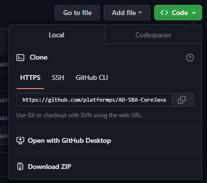

# AD - SBA - Core Java/Hibernate/JUnit - Learner Version

## School Management System
### Business Requirement:
Your task is to create a basic School Management System
where students can register for courses, and view the
course assigned to them.
### Work-Flow:
Only students with the right credentials can log in.
Otherwise, a message is displayed stating: “Wrong Credentials”.
Valid students are able to see the courses they are registered for.
Valid students are able to register for any course in the system as
long as they are not already registered.

### Submission Guideline
After completing all of the tasks or requirements, show it to the instructor and convert your project into a zip file. Upload the zip file to Canvas. 
**(NOTE: Do not upload / push on github)**

### Maven Project Requirements:

- [Amazon Corretto 17 JDK](https://docs.aws.amazon.com/corretto/latest/corretto-17-ug/downloads-list.html) 
- [Hibernate](https://mvnrepository.com/artifact/org.hibernate/hibernate-core)
- [MySQL Connector Java](https://mvnrepository.com/artifact/mysql/mysql-connector-java)
- [Project lombok](https://mvnrepository.com/artifact/org.projectlombok/lombok)
- [Junit jupiter api](https://mvnrepository.com/artifact/org.junit.jupiter/junit-jupiter-api)
- [Junit jupiter engine](https://mvnrepository.com/artifact/org.junit.jupiter/junit-jupiter-engine)
- [Junit jupiter param](https://mvnrepository.com/artifact/org.junit.jupiter/junit-jupiter-params)
- [Junit platform suite](https://mvnrepository.com/artifact/org.junit.platform/junit-platform-suite-engine)
- [Junit platform runner](https://mvnrepository.com/artifact/org.junit.platform/junit-platform-runner)

### Demonstration to clone GitHub repository
- click on `<> Code`

- Select HTTPS tab and copy the url 
- Open Git Bash and change the working directory to the location where you want the project clone directory.
- Type:  git clone and paste the url you copied earlier
- Example:  git clone https://github.com/platformps/AD-SBA-CoreJava-Hibernate-JUnit-Learner.git
- This action will copy an existing Git repository from the owner account into your current local directory. Your copy is completely isolated from the  original repository giving you the ability work on the newly cloned 
- project independently.  [More about clone](https://docs.github.com/en/repositories/creating-and-managing-repositories/cloning-a-repository)
#### Requirement 1 - Models:
-In the Project you have two **Model** classes named **Student.java** and **Course.java** under **Model** package.

- Each Model class **requires**: 
 - no args constructor
 - all args constructor
 - required args constructor
 - setters and getter
 - toString (exclude collections to avoid infinite loops)
 - override equals and hashcode methods (don't use lombok here)
 - helper method
##### Student (`@Table(name = "student")`)
| Field    | Datatype     | Description                 | Database attributes `@Column()`                                                                                                                                                                                        | 
|----------|--------------|-----------------------------|------------------------------------------------------------------------------------------------------------------------------------------------------------------------------------------------------------------------|
 | email    | String       | Student’s unique identifier | Primary key, 50 character limit, name `email`                                                                                                                                                                          |
 | name     | String       | Student’s name              | 50 character limit, not null, name `name`                                                                                                                                                                              |
 | password | String       | Student’s password          | 50 character limit not null, name `password`                                                                                                                                                                           |
 | courses  | Set\<Course> | Student courses list        | Join table strategy name `student_courses` , name of student primary key column `student_email` and inverse primary key (courses) column `courses_id` , fetch type `EAGER`, cascade type `DETACH,REMOVE,MERGE,PERSIST` |

##### Course (`@Table(name = "course")`):

| Field      | Datatype      | Description              | Database attributes `@Column()`                                                    | 
|------------|---------------|--------------------------|------------------------------------------------------------------------------------|
| id         | int           | Course unique identifier | Primary key , generation type `IDENTITY`,                                          |
| name       | String        | Course name              | 50 character limit, not null                                                       |
| instructor | String        | Instructor name          | 50 character limit not null                                                        |
| students   | Set\<Student> | Course learners list     | fetch type `EAGER`, cascade type `DETACH,REMOVE,MERGE,PERSIST`, mappedBy `courses` | 

---
#### Requirement 2 - Data Access Object  (dao) interfaces:

##### StudentI:
- You can **NOT** add more methods in the interfaces than the definition below.
  
| Abstract method         | Return type    | Parameters                    | Description                                                                                                     | 
|-------------------------|----------------|-------------------------------|-----------------------------------------------------------------------------------------------------------------|
| createStudent           | void           | Student                       | persist student to database, also handle commit,rollback, and exceptions                                        |
| getAllStudents          | List\<Student> | None                          | return all students from database, also handle commit,rollback, and exceptions                                  |
| getStudentByEmail       | Student        | String email                  | return student if exists, also handle commit,rollback, and exceptions                                           |
| validateStudent         | boolean        | String email, String password | match email and password to database to gain access to courses, also handle commit,rollback, and exceptions     |
| registerStudentToCourse | void           | String email, int courseId    | register a course to a student (collection to prevent duplication), also handle commit,rollback, and exceptions |
| getStudentCourses       | List\<Course>  | String email                  | get all the student courses list (use native query), also handle commit,rollback, and exceptions                | 

##### CourseI:
- You can **NOT** add more methods in the interfaces than the definition below.
  
| Abstract method         | Return type   | Parameters                    | Description                                                                                                     | 
|-------------------------|---------------|-------------------------------|-----------------------------------------------------------------------------------------------------------------|
| createCourse            | void          | Course                        | persist course to database, also handle commit,rollback, and exceptions                                         |
| getAllCourses           | List\<Course> | None                          | return all courses from database, also handle commit,rollback, and exceptions                                   |
| getCourseById           | Course        | int courseId                  | return course if exists, also handle commit,rollback, and exceptions                                            |
---
#### Requirement 3 - Service layer:
The classes listed below are concrete classes. The following class implements the **StudentI** and **CourseI** interfaces, as well as overrides and implements all abstract service methods.

implement interfaces:
- StudentService
- CourseService
---
#### Requirement 4 - Utility classes:
- hibernate configuration session factory helper
- data initializer helper (dummy data dump)
---
#### Requirement 5 - JUnit:
- Write at least one junit test
---
#### Project Tree example

#### Workflow example

